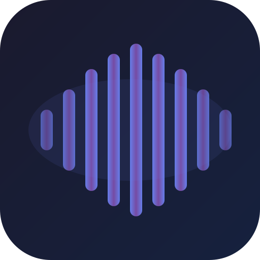

<p align="center">
  
</p>

<h1 align="center">Music Sync App</h1>

<p align="center">
  <a href="https://www.electronjs.org/">
    
  </a>
  <a href="https://react.dev/">
    
  </a>
  <a href="https://www.typescriptlang.org/">
    
  </a>
  
</p>

<p align="center">
  <b>A modern, beautiful, and powerful offline music player built with web technologies.</b>
</p>

---

## ✨ Features

- **🎧 Extensive Format Support**: Plays `mp3`, `flac`, `opus`, `ogg`, `wav`, `aac`, `m4a`, `wma`, `aiff`, `amr`, and `webm`.
- **📥 YouTube Downloader**: Built-in tool to download high-quality audio with automatic metadata tagging and thumbnail embedding.
- **🔍 Smart Identification**: Identify unknown tracks using audio fingerprinting (AcoustID + MusicBrainz).
- **📝 AI Lyrics**: Generate synchronized lyrics locally using OpenAI Whisper.
- **🎨 Beautiful UI**: Glassmorphism design with a real-time audio visualizer.
- **📂 Playlist Management**: Create, edit, and manage playlists seamlessly.
- **🏷️ Metadata Editor**: Auto-reads ID3 tags; edit artist, album, and cover art.
- **⚡ System Tray**: Control playback from the background.

---

## 📸 Screenshots

### 🎵 Main Interface
<p align="center">
  
</p>

### 📥 YouTube Downloads
<p align="center">
  
</p>

### 🔍 Song Identification (AcoustID)
<p align="center">
  
</p>

### 🎤 AI Lyrics Generation
<p align="center">
  
</p>

### 📂 Playlist Management
<p align="center">
  
</p>

---

## 🚀 Installation

### Prerequisites
- [Node.js](https://nodejs.org/) (v16 or higher)
- [Git](https://git-scm.com/)

### Setup
```bash
# Clone the repository
git clone https://github.com/Abdullahu5mani/Music-Electron-App.git
cd Music-Electron-App

# Install dependencies (using legacy-peer-deps recommended for some Electron packages)
npm install --legacy-peer-deps

# Run in development mode
npm run dev
```

### Build for Production
To create an executable for your OS:
```bash
npm run build
```
The output file will be in the `dist/` folder.

---

## ⌨️ Shortcuts

| Action | Shortcut |
|--------|----------|
| **Play / Pause** | `Space` |
| **Next Track** | `Arrow Right` |
| **Previous Track** | `Arrow Left` |
| **Volume Up** | `Arrow Up` |
| **Volume Down** | `Arrow Down` |
| **Mute** | `M` |

---

## 📄 License

This project is licensed under the MIT License - see the [LICENSE](LICENSE) file for details.

---

<p align="center">
  Made with ❤️ by <a href="https://github.com/Abdullahu5mani">Abdullahu5mani</a>
</p>
