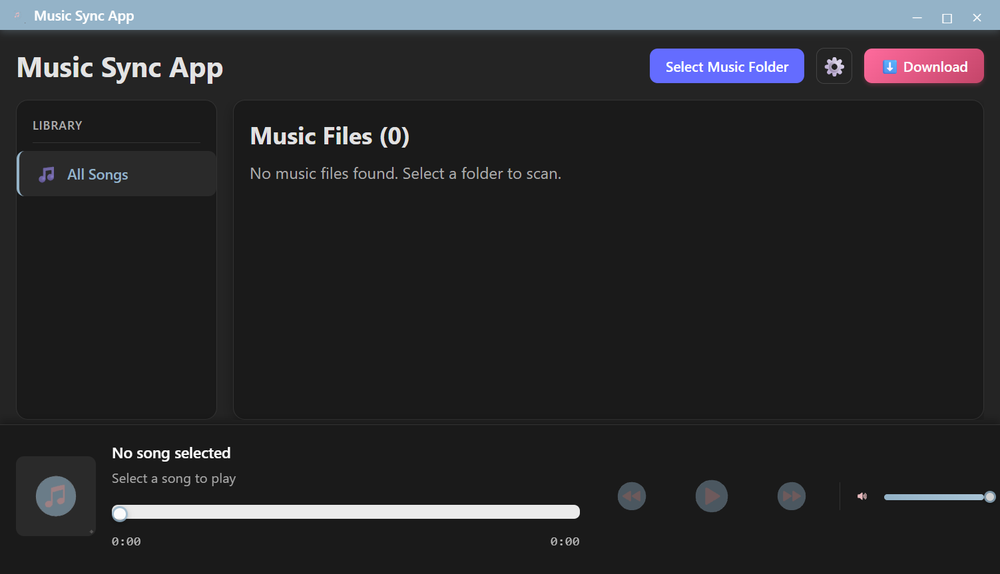
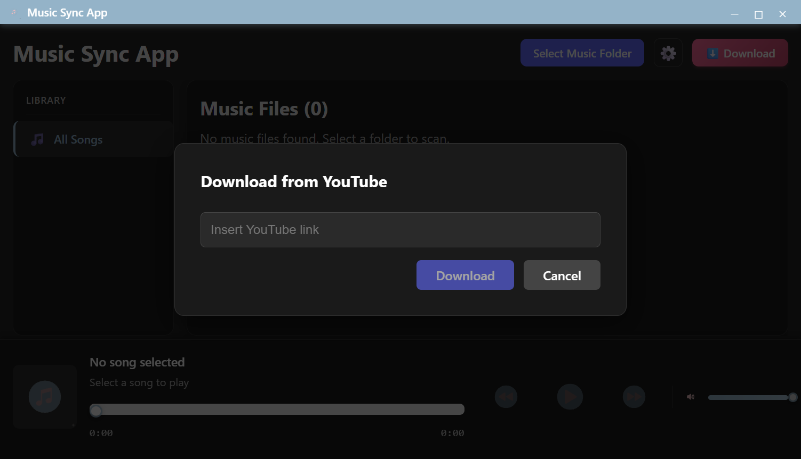
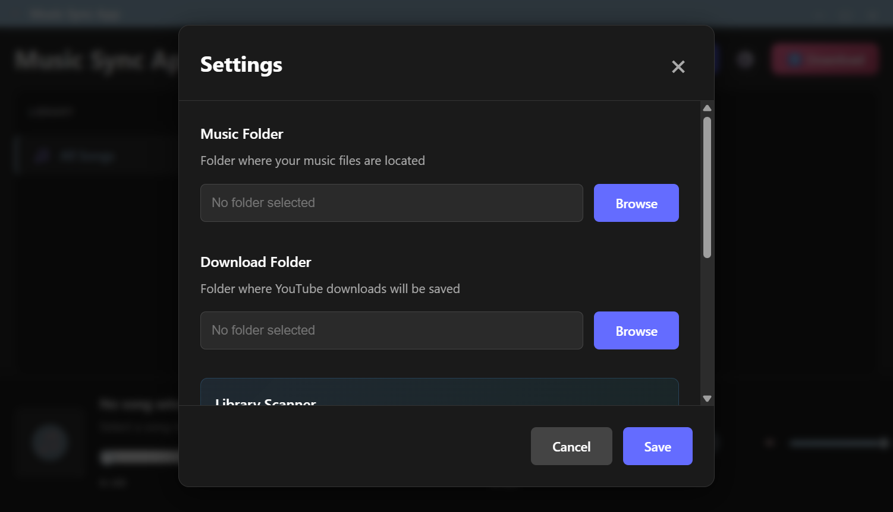

<p align="center">
  
</p>

<h1 align="center">🎵 Music Sync App</h1>

<p align="center">
  <strong>A modern, feature-rich desktop music player with YouTube downloading and intelligent song identification</strong>
</p>

<p align="center">
  
  
  
  
  
</p>

<p align="center">
  <a href="#-features">Features</a> •
  <a href="#-screenshots">Screenshots</a> •
  <a href="#-installation">Installation</a> •
  <a href="#-usage">Usage</a> •
  <a href="#-tech-stack">Tech Stack</a> •
  <a href="#-architecture">Architecture</a>
</p>

---

## ✨ Features

### 🎶 Music Playback
- **High-quality audio playback** using Howler.js with support for MP3, FLAC, WAV, M4A, AAC, OGG, OPUS, WMA, AIFF, and more
- **Seek bar with draggable slider** for precise position control
- **Volume control** with smooth adjustment
- **Previous/Next track navigation** with playlist wrap-around
- **Auto-play next song** when current track ends
- **Media Session API integration** for native OS media controls (play/pause from keyboard, headphones, etc.)

### 📥 YouTube Downloader
- **Download audio from YouTube** directly within the app
- **Automatic yt-dlp binary management** - downloads and updates automatically
- **High-quality MP3 conversion** with embedded thumbnails and metadata
- **Progress tracking** with download notifications
- **Rate limiting protection** (10-second delay between downloads to avoid blocks)
- **Cross-platform support** - Windows, macOS (Intel & Apple Silicon), Linux

### 🔍 Audio Fingerprinting & Song Identification
- **AcoustID integration** for audio fingerprint-based song identification
- **MusicBrainz metadata lookup** for accurate title, artist, album, and release information
- **Cover art downloading** with intelligent fallback system (tries multiple sources)
- **Automatic metadata writing** - embeds identified info directly into your music files
- **Smart release selection** - prioritizes original albums over compilations/soundtracks

### 📚 Library Management
- **Recursive folder scanning** - finds all music files in nested directories
- **Sorting options** - by Title, Artist, Track Number, or Date Added
- **Artist/Album filtering** - sidebar navigation to browse by artist or album
- **Scan status tracking** - SQLite database remembers which files have been scanned
- **File change detection** - automatically re-scans modified files
- **Batch scanning** - scan your entire library with progress tracking and cancellation

### 🎨 Modern UI/UX
- **Custom frameless window** with soft blue title bar
- **Dark theme** optimized for music listening
- **Responsive design** - adapts to different window sizes
- **Custom scrollbars** with OverlayScrollbars for smooth scrolling
- **Album art display** in song list and playback bar
- **Toast notifications** for scan results and download status

### 🖥️ System Integration
- **System tray icon** - minimize to tray, quick play/pause toggle
- **Persistent settings** - remembers your music and download folders
- **Binary manager** - shows status of required dependencies (yt-dlp)

---

## 📸 Screenshots

### Main Interface
The clean, modern interface featuring the sidebar for library navigation, song list with album art, and the playback bar with seek and volume controls.



### YouTube Downloader
Download music directly from YouTube with automatic metadata and thumbnail embedding.



### Settings Panel
Configure your music and download folders, view library scan statistics, and manage binary dependencies.



---

## 🚀 Installation

### Prerequisites
- [Node.js](https://nodejs.org/) 18+ 
- [npm](https://www.npmjs.com/) or [yarn](https://yarnpkg.com/)

### Setup

1. **Clone the repository**
   ```bash
   git clone https://github.com/Abdullahu5mani/Music-Electron-App.git
   cd Music-Electron-App
   ```

2. **Install dependencies**
   ```bash
   npm install
   ```

3. **Run in development mode**
   ```bash
   npm run dev
   ```

4. **Build for production**
   ```bash
   npm run build
   ```

---

## 📖 Usage

### Getting Started

1. **Select your music folder** - Click "Select Music Folder" or configure it in Settings
2. **Browse your library** - Use the sidebar to filter by All Songs, Artist, or Album
3. **Play music** - Click any song to start playback
4. **Control playback** - Use the playback bar for play/pause, seek, and volume

### Downloading from YouTube

1. Click the **⬇️ Download** button
2. Paste a YouTube URL
3. Click **Download**
4. The app will automatically:
   - Download the yt-dlp binary if needed (first time only)
   - Extract audio as high-quality MP3
   - Embed the video thumbnail as cover art
   - Add available metadata
   - Save to your configured download folder

### Identifying Unknown Songs

For songs without proper metadata:

1. Click the **🔍** button next to any song
2. The app will:
   - Generate an audio fingerprint using Chromaprint
   - Look up the fingerprint on AcoustID
   - Fetch detailed metadata from MusicBrainz
   - Download cover art from Cover Art Archive
   - Write all metadata to your file

**Scan Status Icons:**
| Icon | Status |
|------|--------|
| 🔍 | Unscanned - click to identify |
| ✅ | Scanned and tagged successfully |
| ⚠️ | Scanned but no match found |
| 🔄 | File changed - needs rescan |
| ⏳ | Currently scanning |

### Batch Scanning

To scan your entire library:

1. Open **Settings** (⚙️ button)
2. Under **Library Scanner**, click "Scan X Unscanned Songs"
3. Watch the progress notification as each file is processed
4. Cancel anytime by clicking the X on the progress bar

---

## 🛠️ Tech Stack

### Core Technologies

| Technology | Version | Purpose |
|------------|---------|---------|
| **Electron** | 39.x | Desktop application framework |
| **React** | 18.x | UI components and state management |
| **TypeScript** | 5.x | Type-safe JavaScript |
| **Vite** | 7.x | Fast build tool and dev server |

### Audio & Media

| Library | Purpose |
|---------|---------|
| **Howler.js** | Cross-platform audio playback |
| **music-metadata** | Read ID3 tags and album art |
| **taglib-wasm** | Write metadata and cover art to files |
| **@unimusic/chromaprint** | Generate audio fingerprints |
| **yt-dlp-wrap** | Download from YouTube |

### External APIs

| Service | Purpose |
|---------|---------|
| **AcoustID** | Audio fingerprint lookup |
| **MusicBrainz** | Music metadata database |
| **Cover Art Archive** | Album artwork |

### Data & Storage

| Technology | Purpose |
|------------|---------|
| **better-sqlite3** | Local metadata cache |
| **JSON files** | App settings persistence |

### UI Components

| Library | Purpose |
|---------|---------|
| **rc-slider** | Seek bar and volume control |
| **overlayscrollbars-react** | Custom themed scrollbars |
| **axios** | HTTP requests to APIs |

---

## 🏗️ Architecture

### High-Level Overview

```
┌─────────────────────────────────────────────────────────────────────┐
│                        ELECTRON APPLICATION                          │
│                                                                      │
│  ┌─────────────────────────────┐    ┌─────────────────────────────┐ │
│  │      MAIN PROCESS           │    │     RENDERER PROCESS        │ │
│  │       (Node.js)             │◄──►│      (React + Vite)         │ │
│  │                             │IPC │                              │ │
│  │  • File system access       │    │  • User interface           │ │
│  │  • System tray              │    │  • Audio playback           │ │
│  │  • YouTube downloads        │    │  • State management         │ │
│  │  • Settings persistence     │    │  • API communication        │ │
│  │  • SQLite database          │    │  • Fingerprint generation   │ │
│  └─────────────────────────────┘    └─────────────────────────────┘ │
│                                                                      │
│  ┌─────────────────────────────────────────────────────────────────┐│
│  │                       PRELOAD SCRIPT                             ││
│  │           Secure bridge between Main and Renderer                ││
│  └─────────────────────────────────────────────────────────────────┘│
└─────────────────────────────────────────────────────────────────────┘
```

### Directory Structure

```
Music-Electron-App/
├── electron/                    # Main Process (Node.js)
│   ├── main.ts                  # App entry point
│   ├── window.ts                # Window management
│   ├── preload.ts               # IPC bridge
│   ├── tray.ts                  # System tray
│   ├── musicScanner.ts          # File system scanning
│   ├── youtubeDownloader.ts     # YouTube download logic
│   ├── settings.ts              # Settings persistence
│   ├── metadataCache.ts         # SQLite cache
│   ├── binaryManager.ts         # yt-dlp binary management
│   └── ipc/
│       ├── handlers.ts          # IPC handler registration
│       └── modules/             # Modular IPC handlers
│           ├── musicHandlers.ts
│           ├── apiHandlers.ts
│           ├── youtubeHandlers.ts
│           ├── systemHandlers.ts
│           └── cacheHandlers.ts
│
├── src/                         # Renderer Process (React)
│   ├── App.tsx                  # Main React component
│   ├── App.css                  # Main styles
│   ├── components/              # UI Components
│   │   ├── TitleBar.tsx         # Custom window title bar
│   │   ├── SongList.tsx         # Music file list
│   │   ├── PlaybackBar.tsx      # Playback controls
│   │   ├── Sidebar.tsx          # Library navigation
│   │   ├── Settings.tsx         # Settings modal
│   │   ├── DownloadButton.tsx   # YouTube download
│   │   ├── DownloadNotification.tsx
│   │   ├── NotificationToast.tsx
│   │   └── BatchScanProgress.tsx
│   ├── hooks/                   # Custom React Hooks
│   │   ├── useAudioPlayer.ts    # Audio playback logic
│   │   ├── useMusicLibrary.ts   # Library management
│   │   └── useSongScanner.ts    # Batch scanning logic
│   └── utils/                   # Utility functions
│       ├── sortMusicFiles.ts
│       ├── fingerprintGenerator.ts
│       ├── acoustidClient.ts
│       ├── musicbrainzClient.ts
│       └── rateLimiter.ts
│
├── screenshots/                 # App screenshots
├── package.json
├── vite.config.ts
├── tsconfig.json
└── electron-builder.json5       # Build configuration
```

### Key Features Implementation

#### Audio Fingerprinting Flow
```
Audio File → Chromaprint (WASM) → Fingerprint → AcoustID API → MusicBrainz ID
                                                                     ↓
                                           MusicBrainz API → Metadata (title, artist, album)
                                                                     ↓
                                           Cover Art Archive → Album artwork
                                                                     ↓
                                           taglib-wasm → Write to file
```

#### Intelligent Release Selection
When MusicBrainz returns multiple releases (compilations, soundtracks, remasters), the app uses a scoring system to select the most likely original release:

| Factor | Score Impact |
|--------|-------------|
| Official status | +100 |
| Album type | +50 |
| Compilation | -200 |
| Soundtrack | -150 |
| Earlier release date | +0 to +50 |

#### Cover Art Fallback System
The app tries multiple cover art URLs in priority order until one succeeds:
1. 250px front cover for each release
2. 500px front cover
3. Original size cover
4. Release group covers

---

## ⚙️ Configuration

### Settings Storage

Settings are stored in your user data directory:

| Platform | Location |
|----------|----------|
| Windows | `%APPDATA%/music-sync-app/app-config.json` |
| macOS | `~/Library/Application Support/music-sync-app/app-config.json` |
| Linux | `~/.config/music-sync-app/app-config.json` |

### Metadata Cache

The SQLite database for tracking scanned files is located at:

| Platform | Location |
|----------|----------|
| Windows | `%APPDATA%/music-sync-app/metadata-cache.db` |
| macOS | `~/Library/Application Support/music-sync-app/metadata-cache.db` |
| Linux | `~/.config/music-sync-app/metadata-cache.db` |

### yt-dlp Binary

The yt-dlp binary is automatically downloaded to:

| Platform | Location |
|----------|----------|
| Windows | `%APPDATA%/music-sync-app/yt-dlp-binaries/yt-dlp.exe` |
| macOS | `~/Library/Application Support/music-sync-app/yt-dlp-binaries/yt-dlp_macos` |
| Linux | `~/.config/music-sync-app/yt-dlp-binaries/yt-dlp_linux` |

---

## 🔊 Supported Audio Formats

| Format | Extension | Notes |
|--------|-----------|-------|
| MP3 | `.mp3` | Most common format |
| FLAC | `.flac` | Lossless audio |
| WAV | `.wav` | Uncompressed |
| M4A | `.m4a` | AAC container |
| AAC | `.aac` | Advanced Audio Coding |
| OGG | `.ogg` | Vorbis codec |
| Opus | `.opus` | Modern codec |
| WMA | `.wma` | Windows Media Audio |
| AIFF | `.aiff` | Apple format |
| MP4 | `.mp4` | When audio-only |
| M4P | `.m4p` | Protected AAC |
| AMR | `.amr` | Adaptive Multi-Rate |

---

## 🐛 Troubleshooting

### Common Issues

**Audio not playing?**
- Ensure the file format is supported
- Check if the file path contains special characters
- Try restarting the app

**YouTube download failing?**
- Check your internet connection
- The yt-dlp binary may need updating (happens automatically)
- Some videos may be region-restricted or unavailable

**Song identification not working?**
- Ensure you have internet connectivity
- Very short songs (< 30 seconds) may not generate reliable fingerprints
- Obscure or unreleased music may not be in the AcoustID/MusicBrainz database

**Cover art not downloading?**
- Not all albums have cover art in the Cover Art Archive
- The app will show a warning notification if no cover art is found

**Batch scanning stops unexpectedly?**
- The WASM fingerprint module has memory limitations
- If you're scanning 50+ files, consider scanning in smaller batches
- Restart the app between large batches

---

## 🤝 Contributing

Contributions are welcome! Feel free to:

1. Fork the repository
2. Create a feature branch (`git checkout -b feature/amazing-feature`)
3. Commit your changes (`git commit -m 'Add amazing feature'`)
4. Push to the branch (`git push origin feature/amazing-feature`)
5. Open a Pull Request

---

## 📄 License

This project is open source and available under the [MIT License](LICENSE).

---

## 🙏 Acknowledgments

- [Electron](https://www.electronjs.org/) - Desktop framework
- [React](https://reactjs.org/) - UI library
- [Howler.js](https://howlerjs.com/) - Audio playback
- [yt-dlp](https://github.com/yt-dlp/yt-dlp) - YouTube downloading
- [AcoustID](https://acoustid.org/) - Audio fingerprinting service
- [MusicBrainz](https://musicbrainz.org/) - Music metadata database
- [Cover Art Archive](https://coverartarchive.org/) - Album artwork

---

<p align="center">
  Made with ❤️ by <a href="https://github.com/Abdullahu5mani">Abdullahu5mani</a>
</p>
